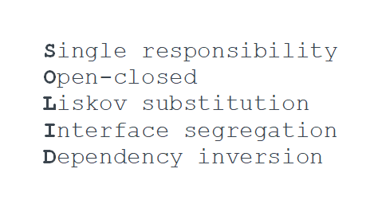

# Вступление

SOLID — мнемонический акроним, для пяти принципов, названных Робертом Мартином \(aka Uncle Bob\). Эти принципы определяют как объединять данные и функции в классы и как сочетать такие классы друг с другом. Соблюдение SOLID способствует улучшению качества архитектуры вашего проекта. Но это не точно.

> This is a good principle, it is good advice, but it’s not a pure truth, nor is it a rule.
>
> Uncle Bob

Воспринимайте их как рекомендации, на которые стоит обратить внимание при разработке и помните:


Любую проблему в ООП можно решить путем введения дополнительного уровня абстракций... Кроме проблемы переизбытка уровней абстракций.


SOLID будем рассматривать в контексте frontend \(javascript, typescript\), но применять их можно в любой ООП-разработке.

